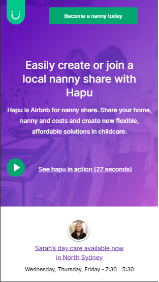

# This project is a challenger of Jungle Devs
First of all, the way I did the application maybe it's not the best.

# How to run the application
Follow the steps below:
- `git clone *COMPLETE HERE*` - Clone the repository.
- `cd your-folder-name` - Enter the folder you cloned.
- `npm install` - Install the dependencies.
- `npm start` - Start the application.
After `npm start`, the application automatically should open in your browser using the URL `localhost:3000/`

It should show something like this:

### Please let your feedback
I'm working my English, so if I've written something wrong, please let me know. I'll help me so much
The same thing for the application. Let your feedback and code review. 
Thank you
